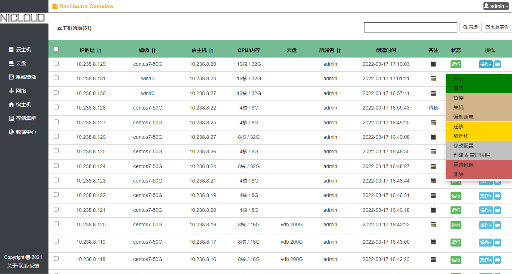
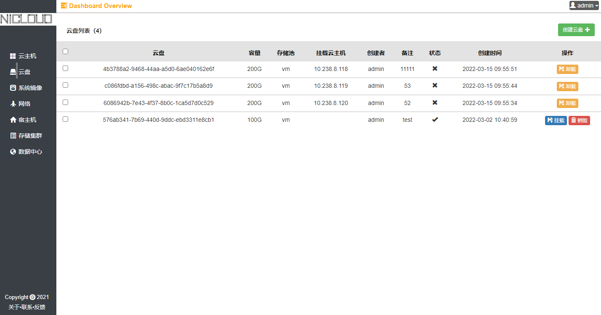
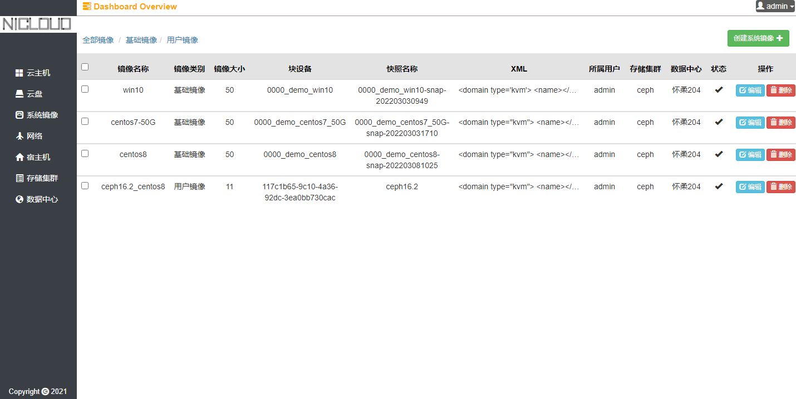
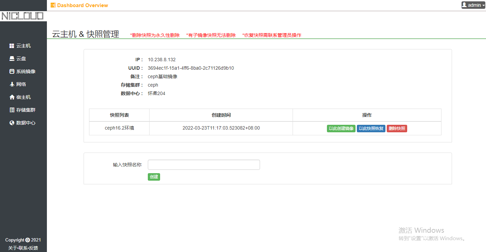
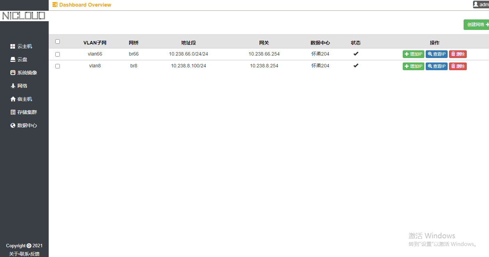

# NICLOUD简介
**NICLOUD是一个轻量级虚拟机管理平台，后端采用golang gin 框架，前端用了VUE，集成了ceph，libvirtd， dhcp等服务**

> 整个项目前后端放在一起了，外层是前端，nicloud文件夹是后端服务，为了节省仓库数量( ╯▽╰)

**功能包括常用的：**
- 云主机创建，删除，开关机，创建快照，自定义配置，重置镜像等
- 云主迁移 & 热迁移，热迁移可以在不停止服务的情况下，更换宿主机
- 云盘创建，自定义容量，删除挂载等
- 把系统快照保存为基础镜像
- 归档：删除的云主机，云盘并非真正删除，可以根据需求保留时间，恢复

**创建表脚本：**

nicloud/scripts/modle_migrate.go

**创建网桥脚本：**

`yum install epel-release.noarch -y && yum install bridge-utils -y` 

`ifconfig eth0 0.0.0.0 up`

`brctl addbr br85`

`brctl addif br85 eth0 &&`

`ifconfig br85 10.0.0.1/24 up &&`

`route add default gw 10.0.0.254`

### 云主机列表页面

### 云硬盘列表页面

### 镜像列表页面

### 快照详情页

### 网络列表页面

